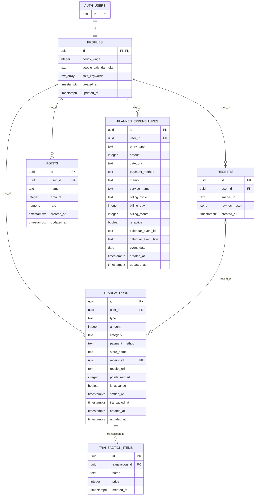

# ER図

Supabase PostgreSQL の永続データを示す。根拠は [`database/schema.sql`](../database/schema.sql) と `database/migrations/` の追加定義。`PK` は主キー、`FK` は外部キー。図のカーディナリティは外部キーの必須・任意性を表す。

## 読み方と対象外

- `auth.users` は Supabase Auth が管理するテーブル。`profiles.id` が同じIDを参照し、ユーザー作成時のトリガーでプロフィールが作られる。
- `transactions.receipt_id` は任意。レシート削除時は `NULL` になり、取引自体は残る。商品明細は取引削除時に連動して削除される。
- `transactions.type` は `cash` / `point` / `income_forecast`。建て替えは別種別ではなく `is_advance` と `settled_at` で表す。
- `planned_expenditures.entry_type` は `subscription` / `calendar`。`calendar_event_id` は Google Calendar のイベントIDを保持する文字列で、DB上の外部キーではない。
- シフトは Google Calendar から取得し、シフト専用テーブルはない。レシート画像本体は Cloudflare R2、モバイル端末の SQLite は表示用キャッシュなので、このER図の対象外。
