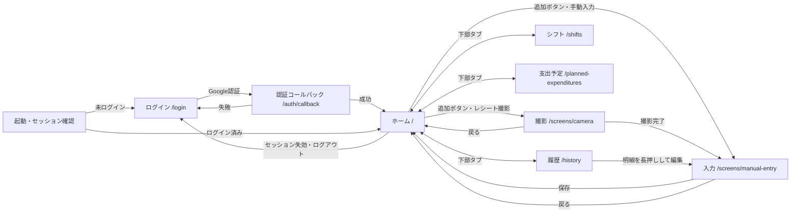
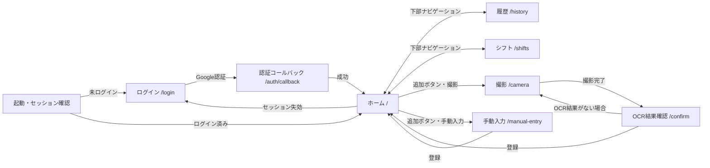

# 画面遷移図

実装にあるルートと主なユーザー操作を示す。矢印は代表的な遷移であり、全画面の戻る操作や各画面内の表示切り替えは省略する。

## モバイルアプリ

根拠: [`mobile/app/`](../mobile/app/) の Expo Router ルート、`(tabs)/_layout.tsx` のタブ・追加ボタン、`_layout.tsx` の認証ガード。

モバイルの中央「追加」はタブの空きスロットに重ねたボタンで、独立した入力画面ではない。撮影後は入力画面に画像を引き渡し、そこで内容を確認・登録する。`支出予定` の追加・編集は同じ画面上のモーダルで行う。通知とアプリショートカットから撮影画面へ直接入る経路もある。

## Webアプリ

根拠: [`web/src/App.tsx`](../web/src/App.tsx) の React Router 定義と各ページの遷移処理。Webの下部ナビゲーションはホーム・履歴・シフトの3画面。

Webにはモバイルの `支出予定` に対応するルートはない。撮影後のOCR確認は、モバイルと異なり `/confirm` という独立画面で行う。
